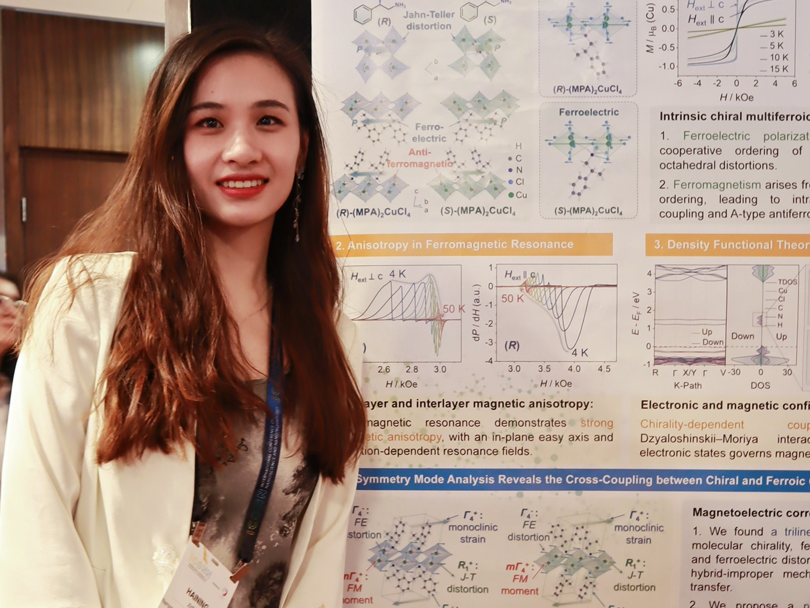
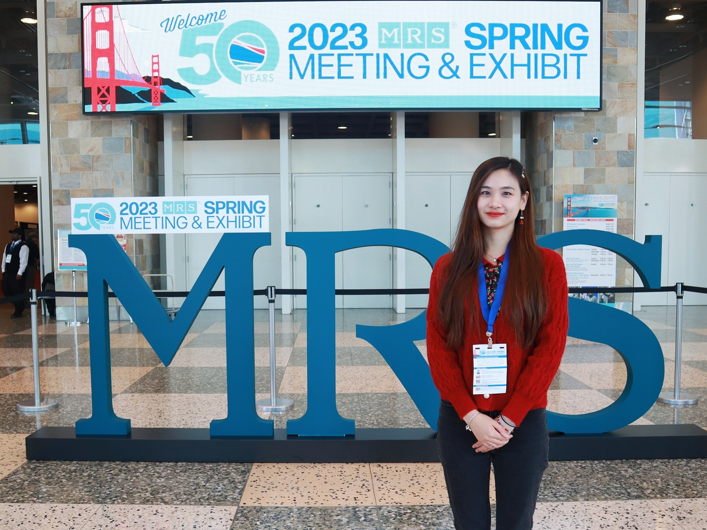
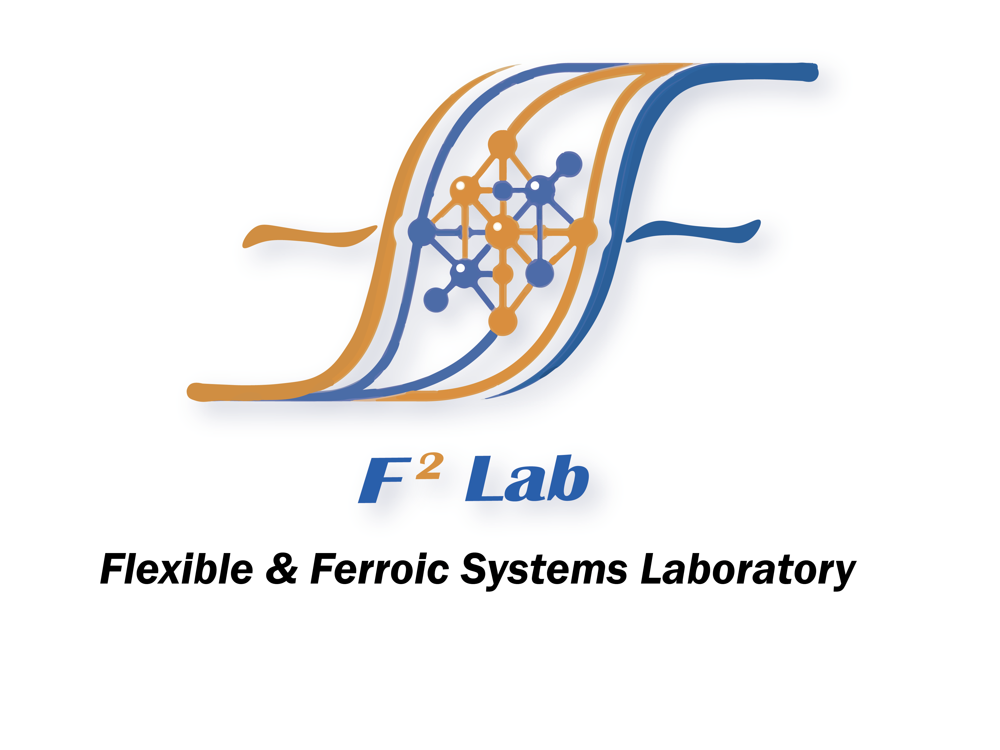

  
    
    

      <button class="tab-btn active" style="text-transform: none !important;font-size: 15px;" onclick="switchGallery('activities')">Activities</button>
      <button class="tab-btn" style="text-transform: none !important;font-size: 15px;" onclick="switchGallery('facilities')">Facilities</button>
    

    

      

        
        

2026 ICONN, in Sydney, Australia 

      

      

        
        

2024 MRS Spring, in Seattle, USA

      

      

        
        

2023 MRS Spring, in San Francisco, USA

      

    

    

      

        
        

To be continued...

      

    

  

  &times;
  

