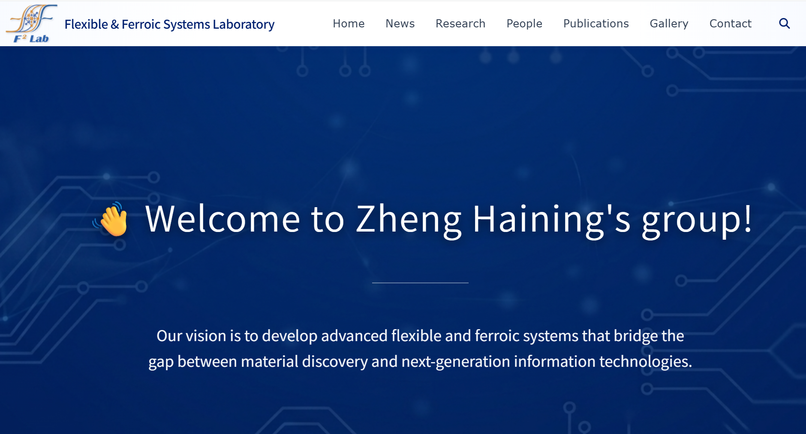

  <!-- 第1个新闻 -->
  

    

      

        <a href="/news/1/">The Official Website for Our Research Group is Now Live!</a>
      

      

      Welcome to our new official website! We invite you to stay updated on our latest research initiatives, team milestones, and open positions on this homepage.
      

      

      June 14, 2026
      

    

    

      <!-- 图片引用 -->
      
    

  

