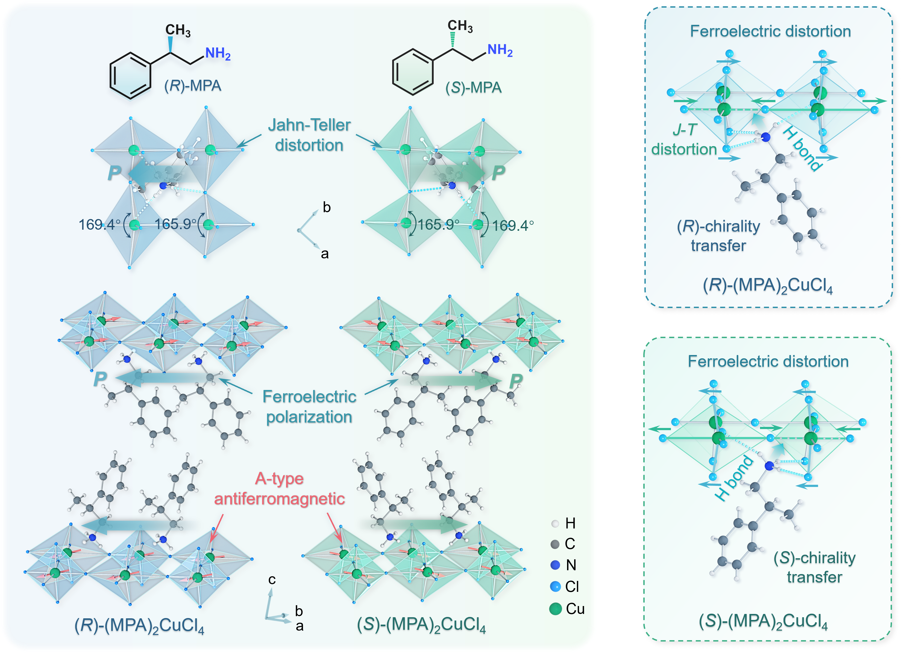
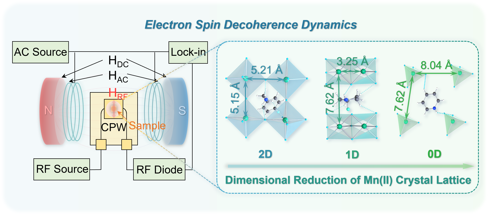
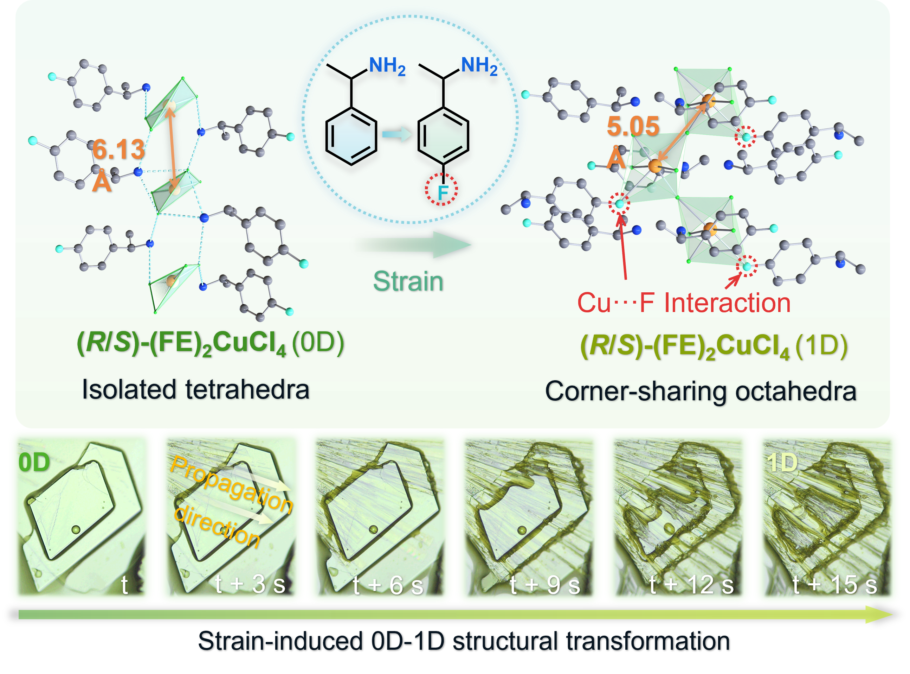
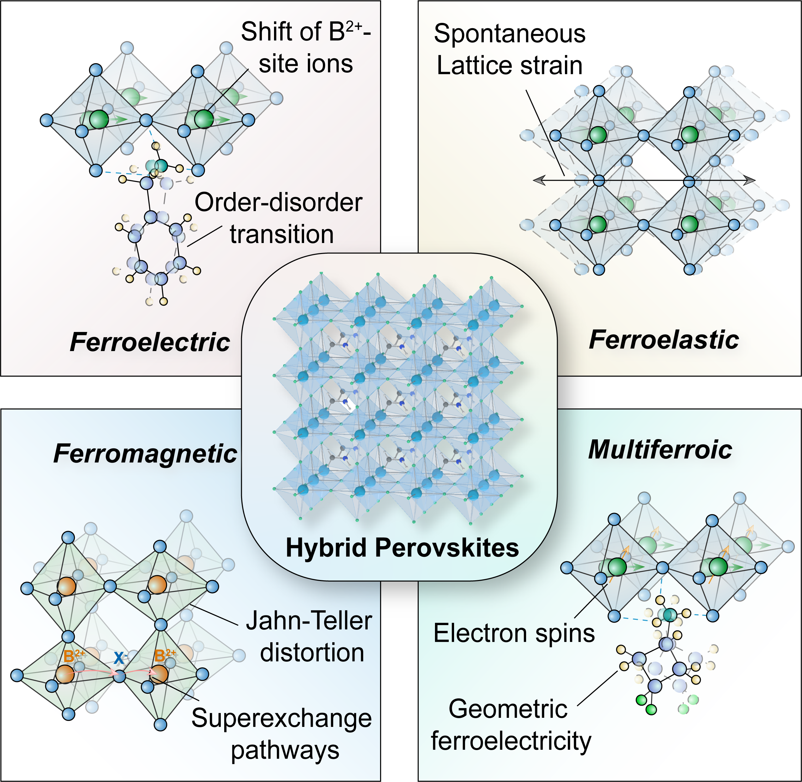
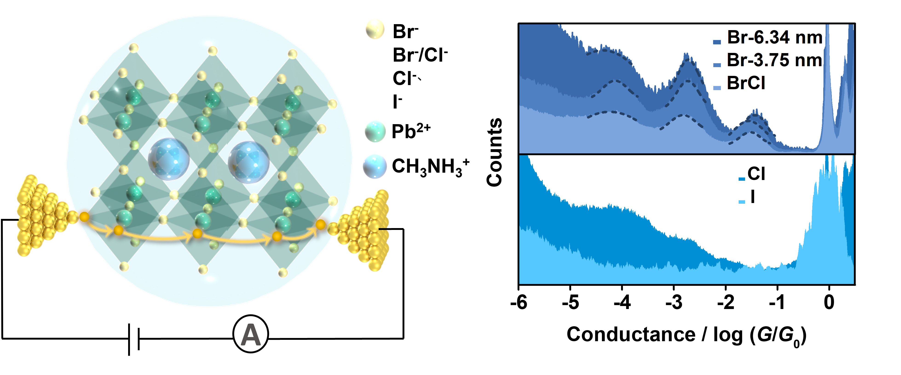
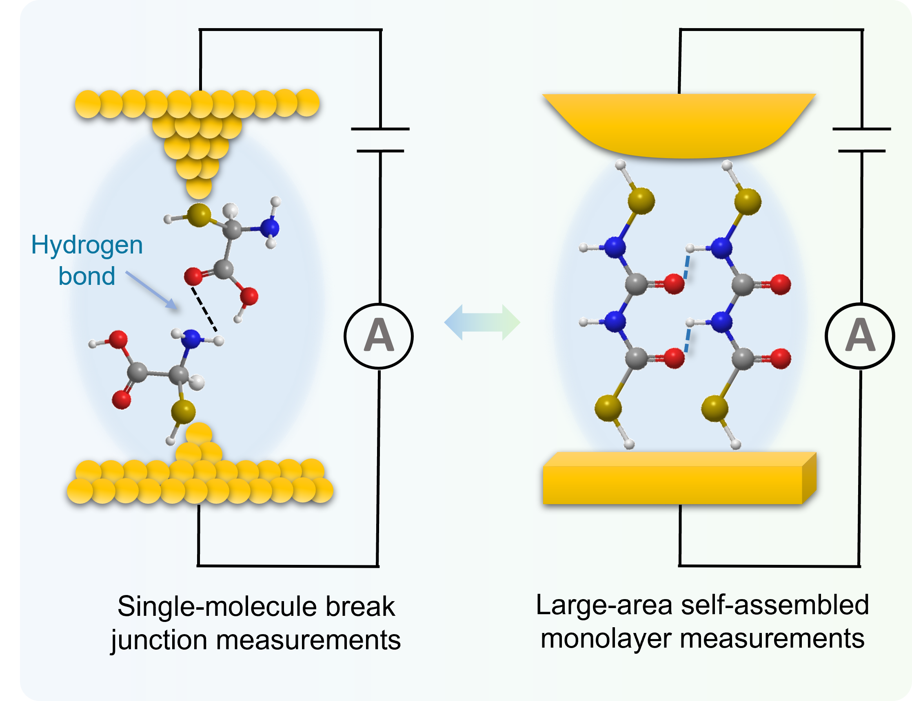
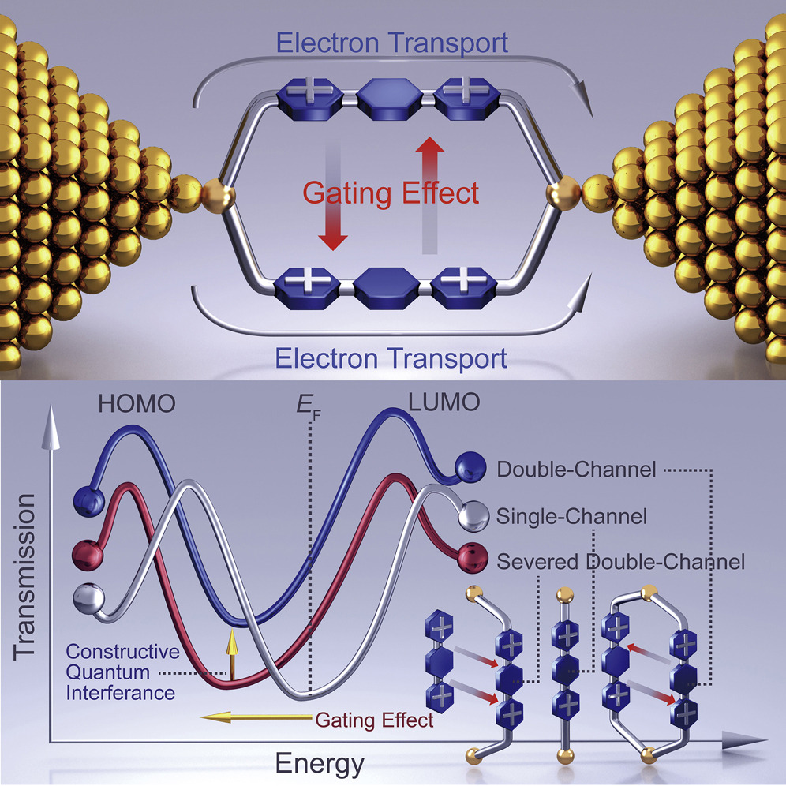
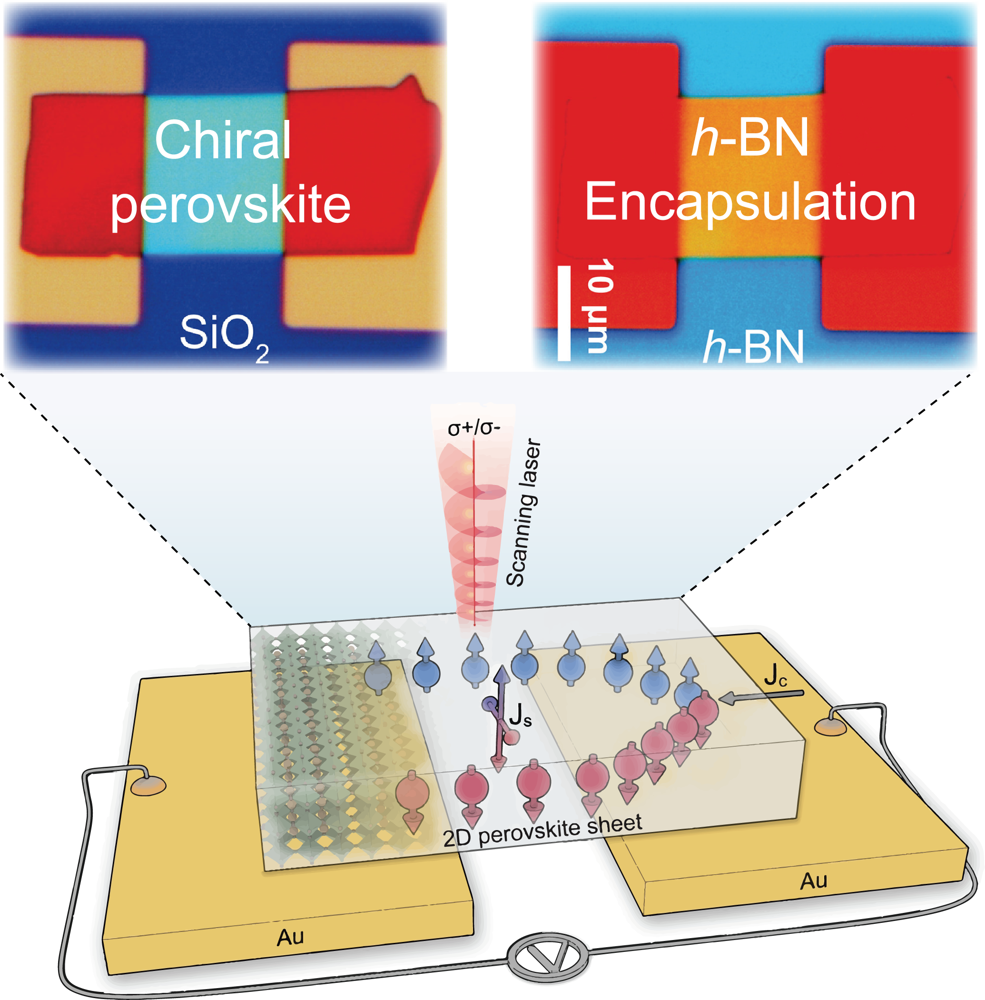
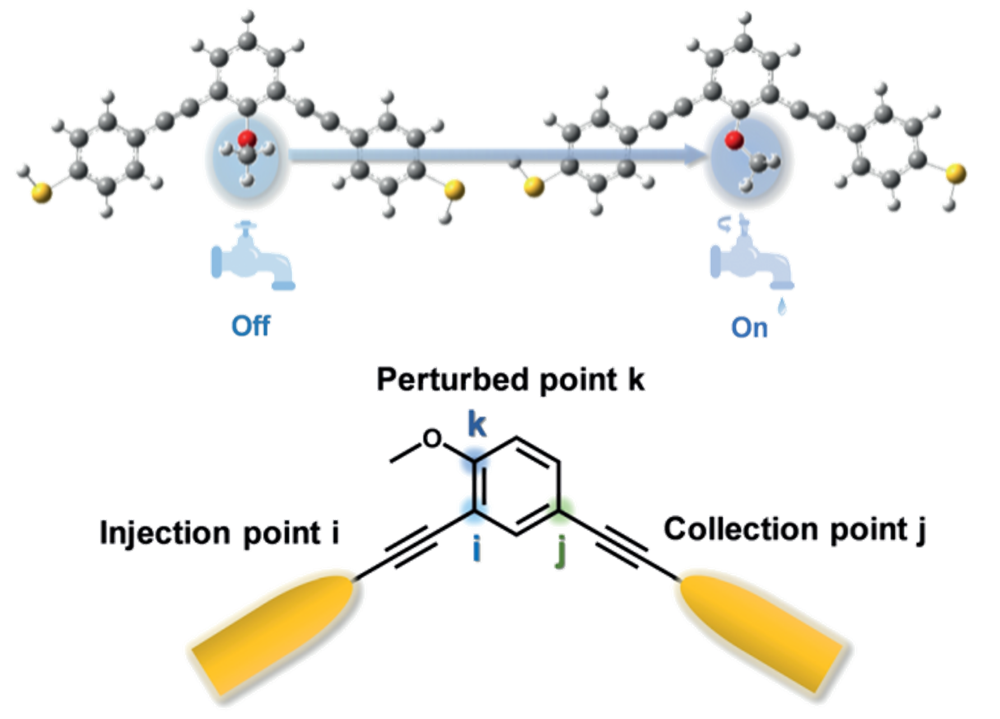
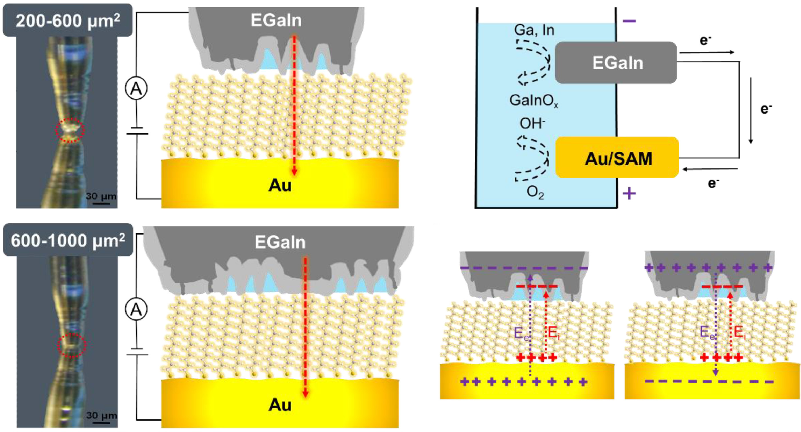

  <!-- 第10篇文献 -->
  

    

      

        <a href="https://www.nature.com/articles/s41467-024-49708-w">10. Chiral multiferroicity in two-dimensional hybrid organic-inorganic perovskites</a>
      

      

      <em><strong>Nature Communications.</strong></em> 2024, <em>10</em>, 5556.
      

      

      <strong>Haining Zheng</strong>, Arup Ghosh, M. J. Swamynadhan, Qihan Zhang, Walter P. D. Wong, Zhenyue Wu, Rongrong Zhang, Jingsheng Chen, Fanica Cimpoesu, Saurabh Ghosh, Branton J. Campbell, Kai Wang*, Alessandro Stroppa*, Kai Wang*, Ramanathan Mahendiran*, Kian Ping Loh*.
      

    

    

      <!-- 图片引用 -->
      
    

  

  <!-- 第9篇文献 -->
  

    

      

        <a href="https://pubs.acs.org/doi/10.1021/jacs.3c05503">9. Electron Spin Decoherence Dynamics in Magnetic Manganese Hybrid Organic-Inorganic Crystals: the Effect of Lattice Dimensionality</a>
      

      

      <em><strong>Journal of the American Chemical Society.</strong></em> 2023, <em>145</em>, 18549-18559.
      

      

      <strong>Haining Zheng</strong>, Arup Ghosh, M. J. Swamynadhan, Gang Wang, Qihan Zhang, Xiao Wu, Ibrahim Abdelwahab, Walter P. D. Wong, Qing-Hua Xu, Saurabh Ghosh, Jingsheng Chen, Branton J. Campbell, Alessandro Stroppa*, Junhao Lin*, Ramanathan Mahendiran*, Kian Ping Loh*.
      

    

    

      <!-- 图片引用 -->
      
    

  

  <!-- 第8篇文献 -->
  

    

      

        <a href="https://pubs.acs.org/doi/10.1021/jacs.2c12525">8. Strain-Driven Solid–Solid Crystal Conversion in Chiral Hybrid Pseudo-Perovskites with Paramagnetic-to-Ferromagnetic Transition</a>
      

      

      <em><strong>Journal of the American Chemical Society.</strong></em> 2023, <em>145</em>, 3569-3576.
      

      

      <strong>Haining Zheng</strong>, Rongrong Zhang, Xiao Wu, Qihan Zhang, Zhenyue Wu, Walter P. D. Wong, Jingsheng Chen, Qing-Hua Xu, Kian Ping Loh*.
      

    

    

      <!-- 图片引用 -->
      
    

  

  <!-- 第7篇文献 -->
  

    

      

        <a href="https://advanced.onlinelibrary.wiley.com/doi/10.1002/adma.202308051">7. Ferroics in Hybrid Organic‐Inorganic Perovskites: Fundamentals, Design Strategies and Implementation</a>
      

      

      <em><strong>Advanced Materials.</strong></em> 2024, <em>36</em>, 2308051.
      

      

      <strong>Haining Zheng</strong>, Kian Ping Loh*.
      

    

    

      <!-- 图片引用 -->
      
    

  

  <!-- 第6篇文献 -->
  

    

      

        <a href="https://www.nature.com/articles/s41467-019-13389-7">6. Room-temperature Quantum Interference in Single Perovskite Quantum Dot Junctions</a>
      

      

      <em><strong>Nature Communications.</strong></em> 2019, <em>10</em>, 5458.
      

      

      <strong>Haining Zheng</strong>, Songjun Hou, Chenguang Xin, Qingqing Wu, Feng Jiang, Zhibing Tan, Xin Zhou, Wenxiang He, Qingmin Li, Jueting Zheng, Longyi Zhang, Junyang Liu, Yang Yang, Jia Shi, Xiaodan Zhang, Ying Zhao, Yuelong Li*, Colin Lambert*, Wenjing Hong*.
      

    

    

      <!-- 图片引用 -->
      
    

  

  <!-- 第5篇文献 -->
  

    

      

        <a href="https://onlinelibrary.wiley.com/doi/abs/10.1002/cjoc.201900245">5. Charge Transport through Peptides in Single-Molecule Electrical Measurements</a>
      

      

      <em><strong>Chinese Journal of Chemistry.</strong></em> 2019, <em>37</em>, 1082-1096.
      

      

      <strong>Haining Zheng</strong>, Feng Jiang, Renze He, Yang Yang, Jia Shi, Wenjing Hong*.
      

    

    

      <!-- 图片引用 -->
      
    

  

   <!-- 第4篇文献 -->
  

    

      

        <a href="https://www.sciencedirect.com/science/article/pii/S2590238519304060">4. Giant Conductance Enhancement of Intramolecular Circuits through Interchannel Gating</a>
      

      

      <em><strong>Matter.</strong></em> 2020, <em>2</em>, 378-389.
      

      

      Hongliang Chen, <strong>Haining Zheng (co-first author)</strong>, Chen Hu, Kang Cai, Yang Jiao, Long Zhang, Feng Jiang, Indranil Roy, Yunyan Qiu, Dengke Shen, Yuanning Feng, Fehaid M. Alsubaie, Hong Guo*, Wenjing Hong*, J. Fraser Stoddart*.
      

    

    

      <!-- 图片引用 -->
      
    

  

  <!-- 第3篇文献 -->
  

    

      

        <a href="https://www.science.org/doi/10.1126/science.adq0967">3. Two-Dimensional Chiral Perovskites with Large Spin Hall Angle and Collinear Spin Hall Conductivity</a>
      

      

      <em><strong>Science.</strong></em> 2024, <em>385</em>, 311-317.
      

      

      Ibrahim Abdelwahab, Dushyant Kumar, Tieyuan Bian, <strong>Haining Zheng</strong>, Heng Gao, Fanrui Hu, Arthur McClelland, Kai Leng, William L. Wilson, Jun Yin*, Hyunsoo Yang*, Kian Ping Loh*.
      

    

    

      <!-- 图片引用 -->
      
    

  

  <!-- 第2篇文献 -->
  

    

      

        <a href="https://onlinelibrary.wiley.com/doi/abs/10.1002/anie.201909461">2. Turning on the Taps: Conformational Control of Quantum Interference to Modulate Single-Molecule Conductance</a>
      

      

      <em><strong>Angewandte Chemie International Edition.</strong></em> 2019, <em>58</em>, 18987-18993.
      

      

      Feng Jiang, Douglas I. Trupp, Norah Algethami, <strong>Haining Zheng</strong>, Wenxiang He, Afaf Alqorashi, Chenxu Zhu, Chun Tang, Ruihao Li, Junyang Liu, Hatef Sadeghi, Jia Shi, Ross Davidson, Marcus Korb, Alexandre N. Sobolev, Masnun Naher, Sara Sangtarash*, Paul J. Low*, Wenjing Hong*, Colin J. Lambert*.
      

    

    

      <!-- 图片引用 -->
      
    

  

  <!-- 第1篇文献 -->
  

    

      

        <a href="https://www.sciencedirect.com/science/article/abs/pii/S0013468621015942">1. The influence of water on the charge transport through self-assembled monolayers junctions fabricated by EGaIn technique</a>
      

      

      <em><strong>Electrochimica Acta.</strong></em> 2021, <em>398</em>, 139304.
      

      

      Jie Shi, Feng Jiang, Shichuan Long, Zhixing Lu, Tianshuo Liu, <strong>Haining Zheng</strong>, Jia Shi, Yang Yang*, Wenjing Hong*.
      

    

    

      <!-- 图片引用 -->
      
    

  
