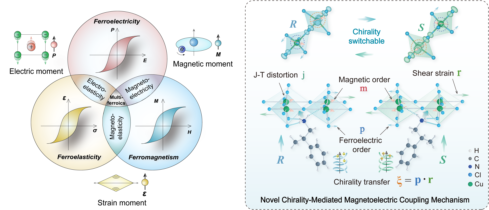
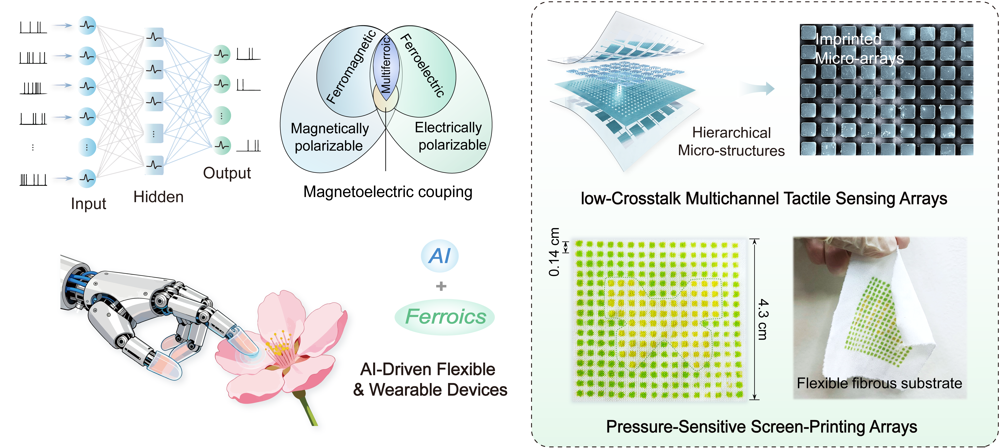
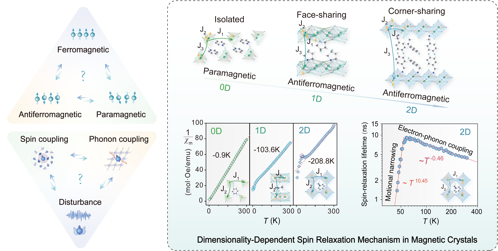
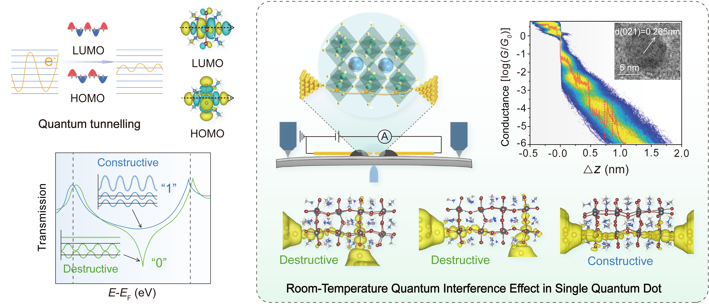

  
  <section class="research-section">
    <h2 class="research-title">1.  Design and Synthesis of Ferroic and Magnetoelectric Crystals</h2>
    

      
The rapid evolution of next-generation information technologies urgently demands novel multifunctional materials that feature coupled electronic and magnetic degrees of freedom. To address this, our research focuses on the precise design and chemical synthesis of organic-inorganic hybrid crystals exhibiting single-phase multiferroicity. By establishing fundamental correlations between crystallographic structural dimensionality and intrinsic ferroic behaviors, we introduce symmetry-breaking strategies—such as strain engineering and chirality modulation—to induce and finely manipulate polar and magnetic orders. This research aims to bridge the gap between fundamental crystal physics and macroscopic molecular design, laying a solid foundation for the practical application of functional magnetoelectric crystals in flexible electronics, spintronics, and smart sensory devices. 

      
下一代信息技术的飞速发展迫切需要兼具电、磁多自由度耦合的新型多功能材料。为此，我们的研究聚焦于具有单相多铁性的有机-无机杂化晶体的精密设计与化学合成。通过建立晶体结构维度与本征铁性行为之间的核心关联，我们引入了应变工程与手性调控等对称性破缺策略，以诱导并精细操控极化与磁有序。该研究旨在打通基础晶体物理与宏观分子设计的壁垒，为功能化磁电晶体在柔性电子、自旋及智能传感器件中的实际应用奠定坚实基础。
      

      
    

  </section>

  <section class="research-section" id="Flexible">
    <h2 class="research-title">2.  AI-Driven Flexible & Wearable Magnetoelectric Devices</h2>
    

      
The profound integration of soft sensory hardware and intelligent algorithms is a critical milestone for next-generation artificial intelligence and unobtrusive human-machine interaction. Our research is dedicated to developing AI-driven flexible wearable platforms leveraging high-performance magnetoelectric interfaces. By synergistically combining imprinted micro-structures and biomimetic tactile arrays with neural network algorithms, we have successfully suppressed lateral crosstalk in multi-channel configurations, achieving high-fidelity dynamic pressure sensing. This hardware-software co-design provides a reliable technological framework for the deployment of intelligent sensory systems in soft robotics, electronic skins, and wearable healthcare monitoring.

      
柔性感知硬件与智能算法的深度融合是推动下一代人工智能与无感人机交互发展的核心关键。我们的研究致力于开发基于高性能磁电界面的AI驱动柔性可穿戴平台。通过将压印微结构、仿生感知的触觉阵列与神经网络算法结合，我们成功抑制了多通道阵列中的横向串扰，实现了高保真度的动态压力感知。这种“硬件-软件”协同设计，为智能感知系统在软体机器人、电子皮肤以及可穿戴健康监测领域的应用提供了可靠技术支撑。 
      

      
    

  </section>

  <section class="research-section" id="Spintronics">
    <h2 class="research-title">3.  Spintronics in Ferroic and Magnetoelectric Crystals</h2>
    

      
Long-coherence electron spins are ideal carriers for high-density storage and ultra-fast qubits. Elucidating their intrinsic decoherence mechanisms is core to developing next-generation spintronic devices. To address this, our work focuses on uncovering the intrinsic physical mechanisms of spin decoherence in ferroic and magnetic crystals. By designing and constructing manganese-based molecular magnets across varied structural dimensionalities, we systematically elucidated the competitive mechanisms between spin-phonon coupling and motional narrowing within low-dimensional lattices, successfully mapping the temperature-dependent evolution of spin-relaxation lifetimes. This research establishes an effective approach to modulating spin characteristics via lattice dimensionality engineering, providing pioneering strategies for the design of high-performance spin carriers with extended coherence times and high integration density.

       
长相干电子自旋是构筑高密度信息存储与超高速量子比特的理想载体，而阐明其本征的退相干机制，则是发展下一代高性能自旋电子器件的核心。我们的工作聚焦于揭示铁性和磁性晶体中自旋退相干的本征物理机制。通过设计构建具有不同晶格维度的锰基分子磁体，我们系统阐明了低维晶格中自旋-声子耦合与运动窄化之间的竞争规律，成功建立了自旋弛豫寿命随温度变化的物理图像。该研究确立了通过晶格维度工程调控自旋特性的有效途径，为设计长相干、高集成度的自旋载体提供了前沿策略。 
      

      
    

  </section>

  <section class="research-section">
    <h2 class="research-title">4.  Charge Transport and Quantum Effects in Molecular Electronics</h2>
    

      
Exploring novel electronic transport mechanisms at the micro- and nano-scale is a key foundation for breaking the physical limits of conventional semiconductor devices and developing molecular-grade information carriers. To address this, our research investigates charge transport characteristics and novel quantum interference effects within low-dimensional systems. Utilizing the mechanically controllable break junction technique, we have achieved the precise observation and reliable modulation of room-temperature quantum interference within single quantum dot junctions, advancing charge transport investigations down to the ångström-scale of a single unit cell.. This suite of research opens up new avenues for the development of ultra-low-power, highly tunable molecular-scale quantum information devices and functional nano-chips.

       
在微纳尺度下探索新型电子输运机制，是突破传统半导体器件物理极限、发展分子级信息载体的关键基础。基于此，我们的研究旨在探索低维体系中的电荷输运特性及新奇的量子干涉效应。通过利用机械可控裂结技术，我们成功实现了单量子点中室温量子干涉效应的精准观测与可靠调控，将电荷传输的研究缩小至埃级单晶胞尺度。这一系列研究为开发超低功耗、高调谐比的分子级量子信息器件与功能化纳米芯片开辟了新途径。
      

      
    

  </section>

